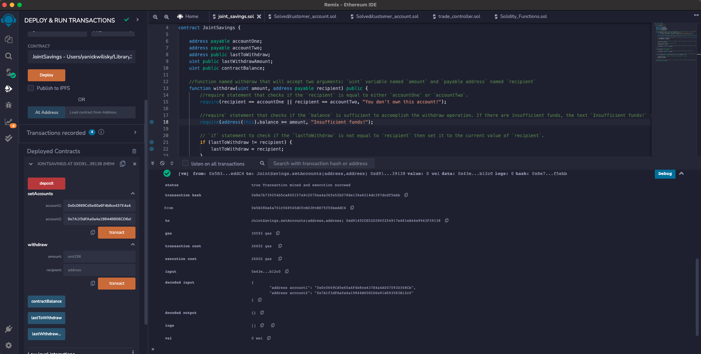
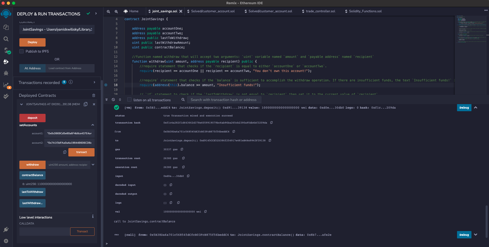
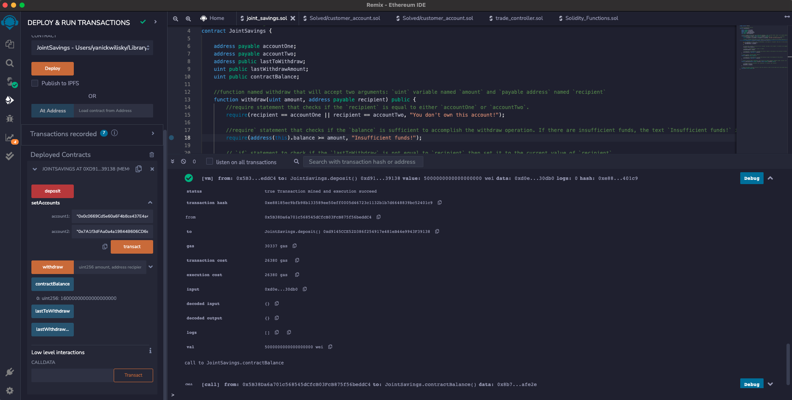
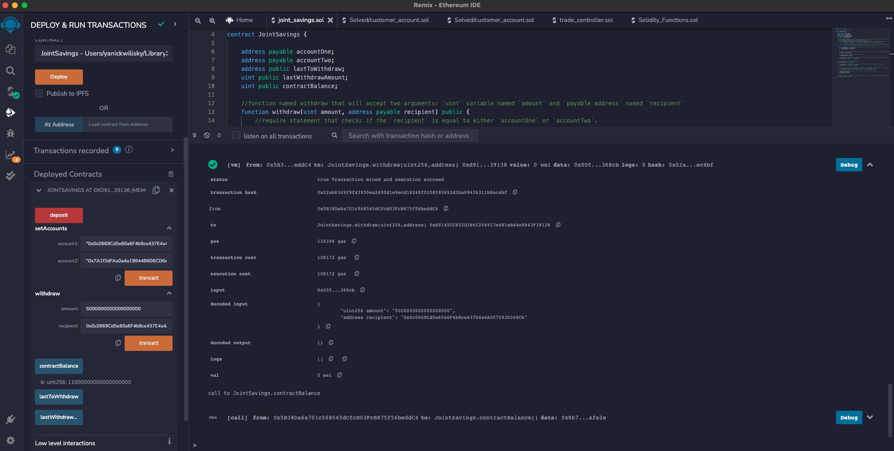
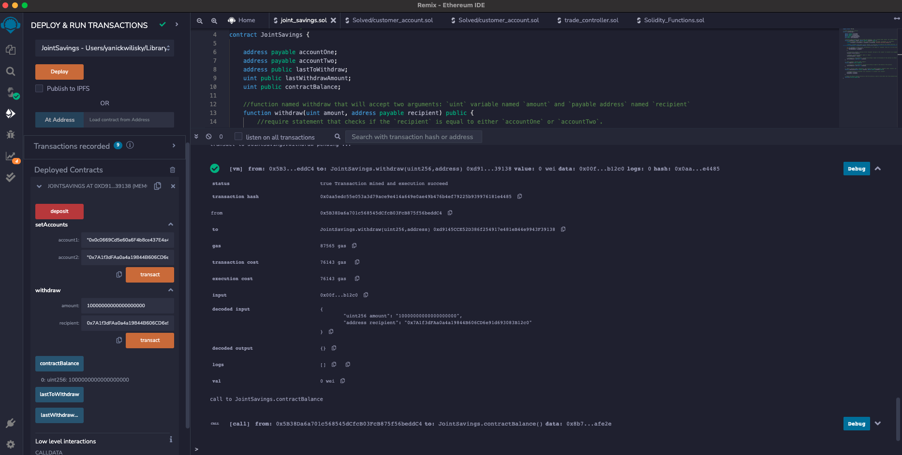
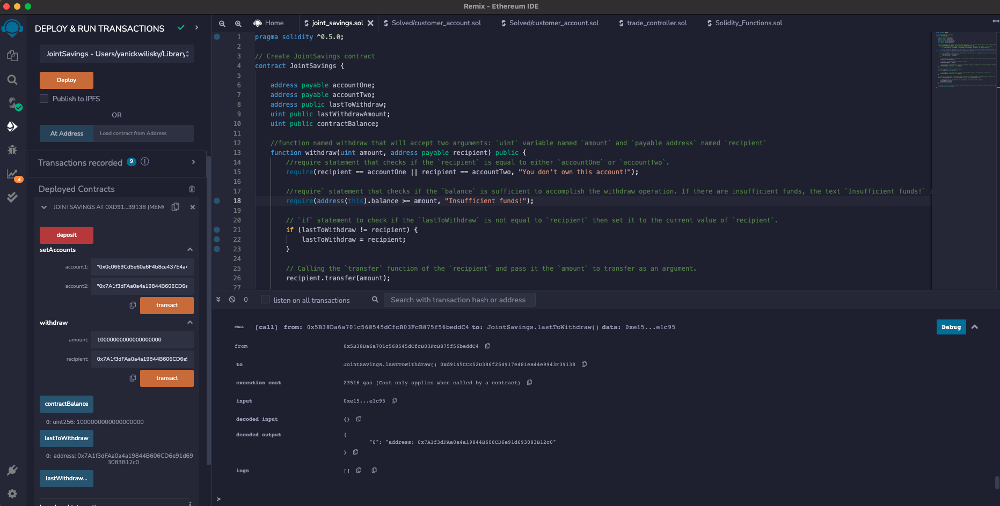
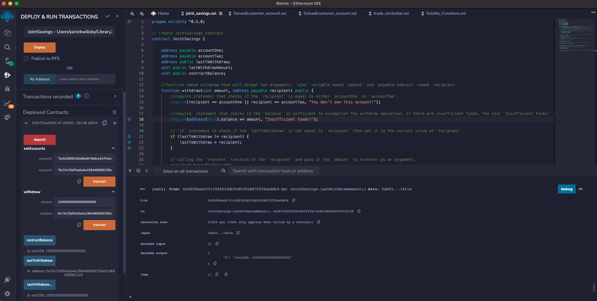

# Smart Saving
SMART SAVING is smart contract app that uses ETH management functions to implement financial institution’s requirements for providing the features of the **joint savings account** enabling the ability to deposit and withdraw funds from the account.

---

## Requirements

REMIX IDE version 1.3.4
This application was writen in Solidity within the Remix IDE desktop application and compiled using version 0.5.0

---

## Getting Started

Once you've open the smart contract into REMIX IDE you'll need to setup the accounts to interact with.

To help familiarize yourself with the function you can either use the following Ethereum addresses or create new, dummy addresses on the Vanity-ETH website, which includes an Ethereum vanity address generator.

```
Dummy account1 address: 0x0c0669Cd5e60a6F4b8ce437E4a4A007093D368Cb
Dummy account2 address: 0x7A1f3dFAa0a4a19844B606CD6e91d693083B12c0
```

First set the authorized Ethereum address that will be able to withdraw funds from your contract in the setAccounts function by adding the two desired address.



Test the deposit functionality of your smart contract by sending 1 ETH as wei with the contract balance.


Here's an example of a second deposit test sending 10 ETH as wei with the contract balance update.



Here's an final example of a third deposit test sending 5 ETH as wei with the contract balance update.



Next step, test the withdraw function by setting a transfer from the smart contract of 5 Eth in wei to account1.



Then test the withdraw function by transfering from the smart contract to account2 the amount of 10 Eth in wei.



You can verify the recepient address to last withdraw by calling the `lastToWithdraw` function using the button of the same name.



And finaly we can verify the last withdraw amount by calling the `lastWithdrawAmount` as displayed in this last example.




---

## Contributors
This application originated from a Berkeley Bootcamp.

For any inquieries, feedbacks or comments about this project please email me at  [yanickw@gmail.com](mailto:yanickw@gmail.com)

I can also be reached on  [LinkedIn](https://www.linkedin.com/in/yanickwilisky/)  or  [Twitter](https://twitter.com/yanickwilisky).

---

## License

MIT License

Copyright (c) 2022 Yanick Wilisky

Permission is hereby granted, free of charge, to any person obtaining a copy of this software and associated documentation files (the "Software"), to deal in the Software without restriction, including without limitation the rights to use, copy, modify, merge, publish, distribute, sublicense, and/or sell copies of the Software, and to permit persons to whom the Software is furnished to do so, subject to the following conditions:

The above copyright notice and this permission notice shall be included in all copies or substantial portions of the Software.

THE SOFTWARE IS PROVIDED "AS IS", WITHOUT WARRANTY OF ANY KIND, EXPRESS OR IMPLIED, INCLUDING BUT NOT LIMITED TO THE WARRANTIES OF MERCHANTABILITY, FITNESS FOR A PARTICULAR PURPOSE AND NONINFRINGEMENT. IN NO EVENT SHALL THE AUTHORS OR COPYRIGHT HOLDERS BE LIABLE FOR ANY CLAIM, DAMAGES OR OTHER LIABILITY, WHETHER IN AN ACTION OF CONTRACT, TORT OR OTHERWISE, ARISING FROM, OUT OF OR IN CONNECTION WITH THE SOFTWARE OR THE USE OR OTHER DEALINGS IN THE SOFTWARE.